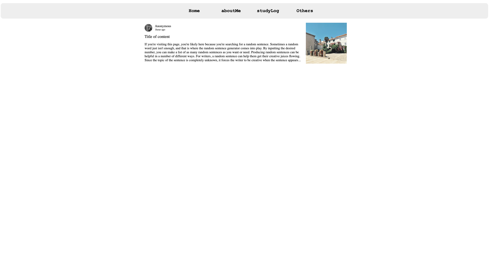
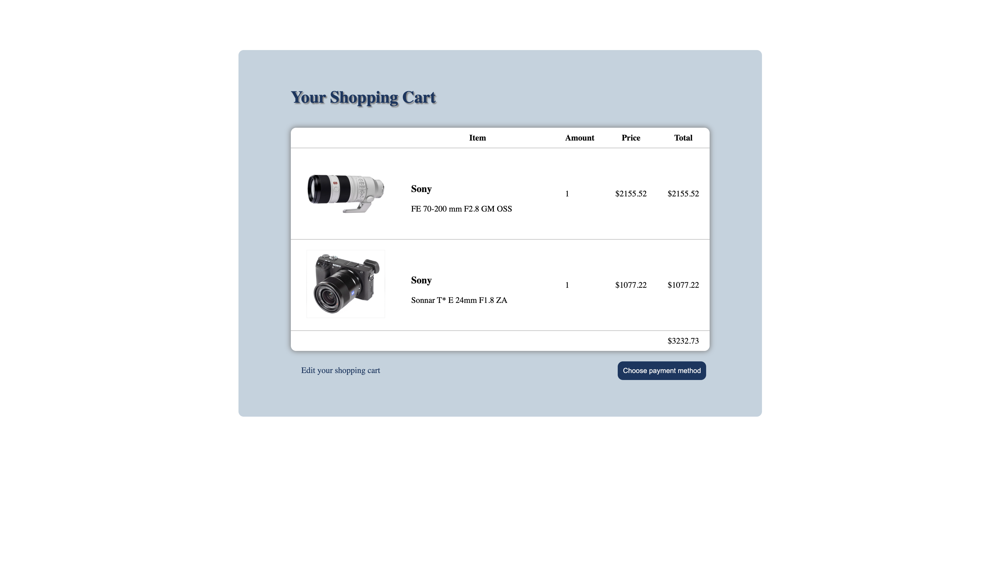

# 개인 포트폴리오 및 쇼핑 카트 UI

개인 포트폴리오 페이지와 쇼핑 카트 기능을 갖춘 웹사이트의 사용자 인터페이스(UI) 연습을 위한 코드를 담은 디렉토리입니다. 직관적인 디자인과 사용자 친화적인 상호작용을 목표로 구현하였습니다.

## 프로젝트 소개

이 프로젝트는 웹 개발 실력을 향상시키고, 현대적인 웹사이트 디자인을 실습하기 위해 만들어졌습니다. 포트폴리오 섹션은 개발자의 기술과 프로젝트를 소개하며, 쇼핑 카트 UI는 실제 온라인 쇼핑 경험을 모방하여 사용자가 제품을 선택하고 결제할 수 있는 프로세스를 제공합니다.

## 주요 기능

- **포트폴리오**: 개인적인 작업과 프로젝트를 소개하는 섹션으로, 방문자들이 개발자의 역량을 한눈에 파악할 수 있습니다.

- **로그인 페이지**: 사용자가 자신의 계정으로 로그인할 수 있는 기능을 제공합니다.

- **랜딩 페이지**: 앱 또는 웹사이트를 위한 매력적인 랜딩 페이지로, 방문자의 관심을 끌고 목표한 행동을 유도합니다.

- **쇼핑 카트**: 사용자가 제품을 선택하고 결제할 수 있는 쇼핑 카트 기능을 구현합니다.

## 사용 기술

- **HTML, CSS를 기반으로 한 마크업과 스타일링**

- **클라이언트 사이드 로직을 위한 JavaScript**

- **반응형 디자인을 위한 CSS 프레임워크**

